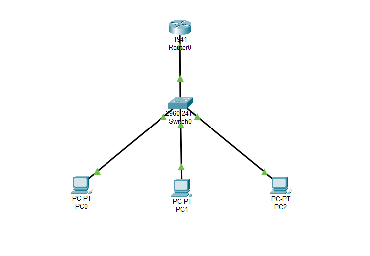
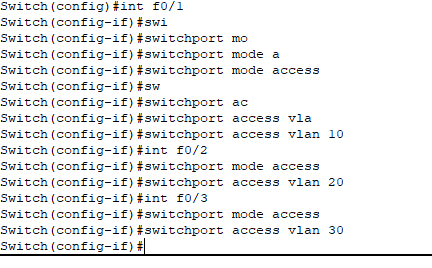
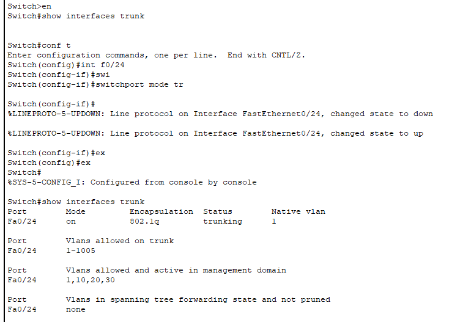
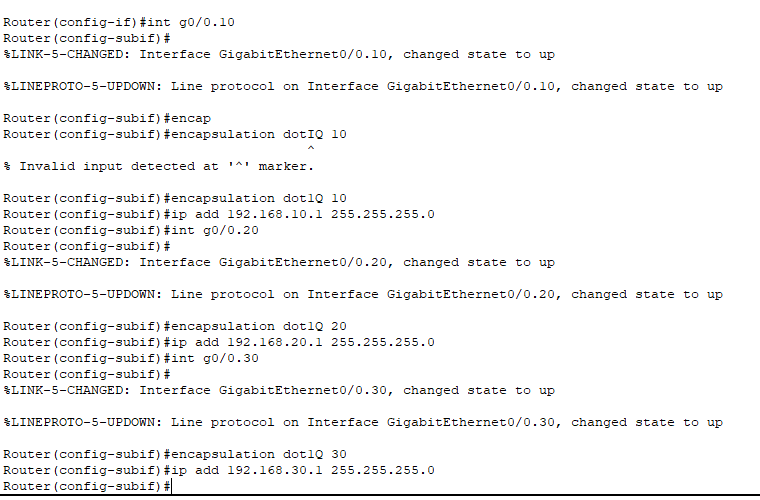
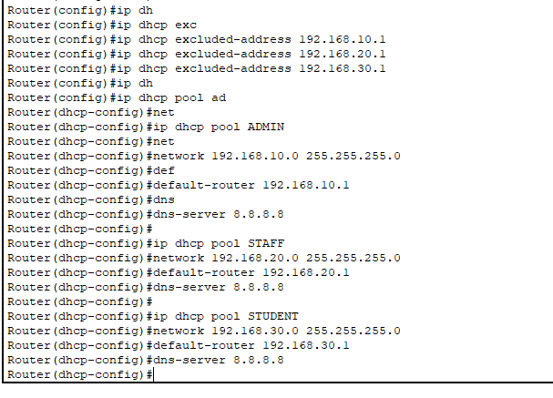
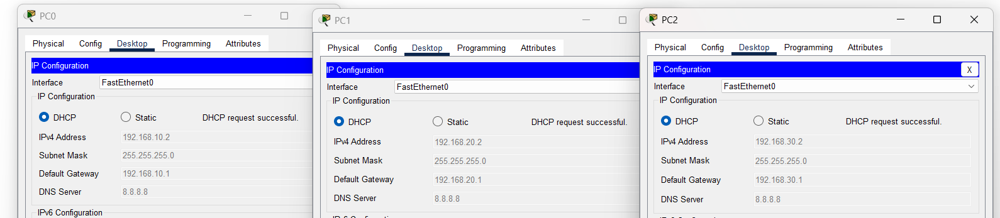
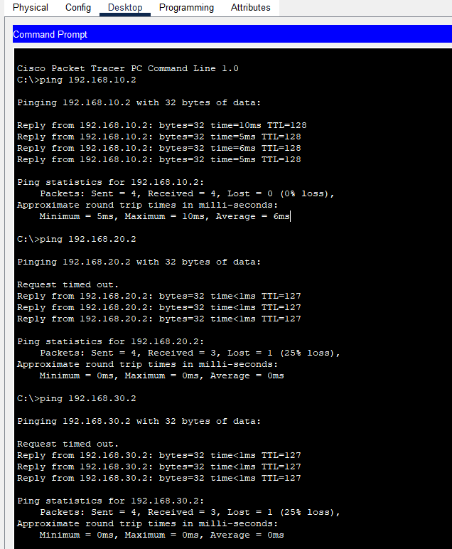
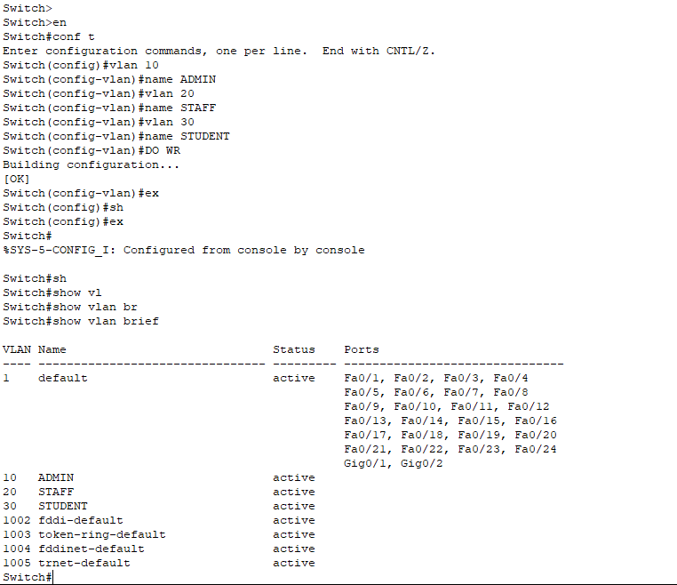

#  Campus Network Design using Cisco Packet Tracer

## Project Overview
This project demonstrates a multi-subnet campus network designed using Cisco Packet Tracer. It includes VLAN segmentation, inter-VLAN routing, and DHCP configuration to simulate a real-world enterprise network environment.

---

## Features
- VLAN segmentation for Admin, Staff, and Students
- Inter-VLAN routing using router-on-a-stick
- DHCP for automatic IP assignment
- Network testing and troubleshooting
- Scalable enterprise network design

---

## Technologies Used
- Cisco Packet Tracer
- VLAN (IEEE 802.1Q)
- DHCP
- Router-on-a-stick
- TCP/IP Networking

---

## Project Files
- campus-network.pkt → Network simulation file
- project-report.pdf → Full technical documentation
- assets/ → Network diagrams and configuration screenshots

---

## Project Screenshots

### 🔷 Network Topology

### 🔷 VLAN Configuration

### 🔷 Switch Trunk Configuration

### 🔷 Router Subinterface (VLAN Routing) Configuration

### 🔷 DHCP Configuration

### 🔷 DHCP Test Results

### 🔷 Ping Test Results

### 🔷 VLAN Configuration Test

---

## Learning Outcome
This project demonstrates practical knowledge in:
- Network design and segmentation
- VLAN configuration
- Inter-VLAN routing
- DHCP configuration
- Network troubleshooting

---

## Author
Chandupa Silva  
Network Engineering Student (UCSC)
